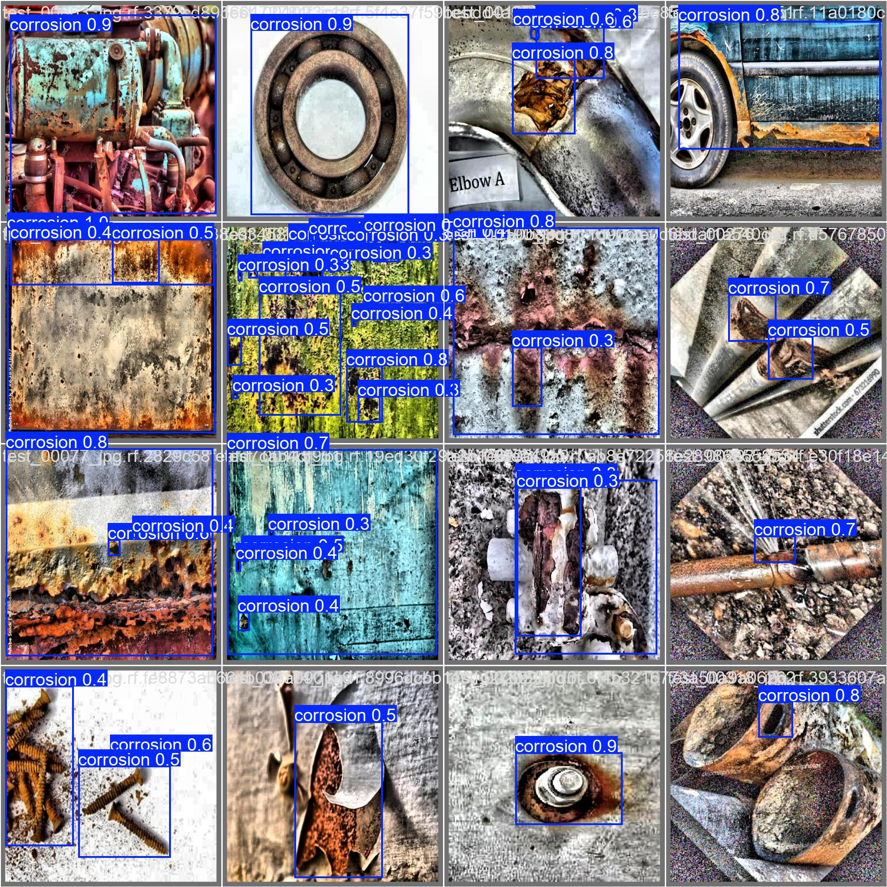
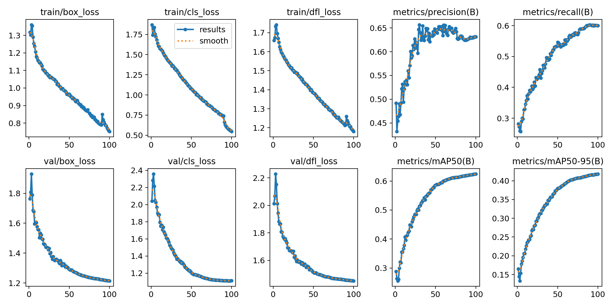
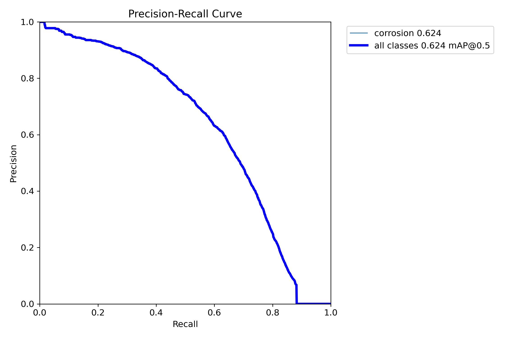

# SpiderBot — Rust & Corrosion Detection

The computer vision module of **SpiderBot**, a spider robot that inspects metal surfaces. A **YOLO** object detection model finds rust and corrosion in the robot's live camera feed and draws bounding boxes around each affected area.

This repository covers the visual detection work: dataset selection, training and comparing three models, and the real-time detection tool used on the robot.



## On the robot

The detection is integrated with the robot and was tested end to end:

```
Pi Camera ──► Raspberry Pi (on the robot) ──Wi-Fi stream──► PC running live_predict.py ──► annotated video + rust count
```

The Raspberry Pi streams its camera over Wi-Fi (set up and launched through SSH), and `live_predict.py` runs the model on the stream in real time, showing the boxes and the number of rust regions and recording the annotated video.

## Model iterations

| | Dataset | Images (train / val / test) | Model | Epochs | mAP@50 | mAP@50-95 |
|---|---|---|---|---|---|---|
| **v1** | [Corrosion YOLOv8](https://universe.roboflow.com/corrosion-yolo-v8/corrosion-yolov8/dataset/1) | 1,638 / 9 / 9 | YOLOv8n | 32 (early stop) | 0.853 | 0.609 |
| **v2** | [Rust Corrosion Detection](https://universe.roboflow.com/averkios/rust-corrosion-detection/dataset/1) | 7,736 / 210 / 232 | YOLO11n | 100 | 0.419 | 0.281 |
| **v3** | [CorrosionLabNEO](https://universe.roboflow.com/labneoluis/corrosionlabneo/dataset/4) | 14,412 / 2,061 / 1,030 | YOLO11s | 100 | **0.624** | **0.418** |

What each iteration taught:

- **v1** scored highest on paper, but its validation set had only **9 images**, far too few to trust. It was overfitting to a small dataset.
- **v2** moved to a much larger dataset for reliable metrics, but its **13 classes** (corrosion severity levels, some with inconsistent labels) split the data too finely and dragged the score down.
- **v3** uses a large **single-class** dataset and a bigger model (YOLO11s). With 2,061 validation images, its 0.62 mAP@50 is both the best and the most trustworthy result, so it is the model used on the robot.

### v3 training results

| Training curves | Precision-recall curve |
|---|---|
|  |  |

Normalized confusion matrix: [docs/training-v3/confusion_matrix_normalized.png](docs/training-v3/confusion_matrix_normalized.png)

Trained for 100 epochs at 640×640 with a batch size of 16.

## Tools

| Script | Purpose |
|---|---|
| [`live_predict.py`](live_predict.py) | Runs the detector on an image, a folder of images, a video, a webcam or a network camera stream. Shows the annotated result, counts rust regions and saves the output to `output/`. `SPACE` pauses, `ESC` quits. |
| [`train.py`](train.py) | Trains a model on a Roboflow dataset, with a GPU check and a dataset check first. |
| [`capture_frames.py`](capture_frames.py) | Saves a frame every few seconds from the robot's camera stream, to label real-world images and improve the dataset. |

## Getting started

Requires **Python 3.9+**. A CUDA GPU is strongly recommended for training; detection runs on CPU too.

```bash
pip install -r requirements.txt
```

**Run detection**: set `SOURCE` at the top of `live_predict.py` (an image, folder, video, `0` for a webcam, or a stream URL such as `http://<pi-ip>:8080`), then:

```bash
python live_predict.py
```

The trained weights are included in [`models/`](models): `v1_yolov8n.pt`, `v2_yolo11n.pt` and `v3_yolo11s.pt` (used by default).

**Train**: download the dataset from Roboflow in **YOLOv11** format, unzip it into `datasets/v3_big/` (so that `datasets/v3_big/data.yaml` exists), then:

```bash
python train.py
```

## Known limitations

- **False positives on rust-like textures**: dark brown shadows between wooden planks and dark, saturated fabrics have been detected as corrosion. Frames captured from the robot's own camera with `capture_frames.py` are meant to be labeled and added to training to reduce this.

## Credits

Datasets from Roboflow Universe:
- *Corrosion YOLOv8* by corrosion-yolo-v8 (CC BY 4.0)
- *Rust Corrosion Detection* by averkios (CC BY 4.0)
- *CorrosionLabNEO* by labneoluis (MIT)

Models trained with [Ultralytics YOLO](https://github.com/ultralytics/ultralytics).

## License

Code: [MIT](LICENSE). The trained models are derived from the datasets above and inherit their attribution requirements, and Ultralytics YOLO is licensed under AGPL-3.0.
